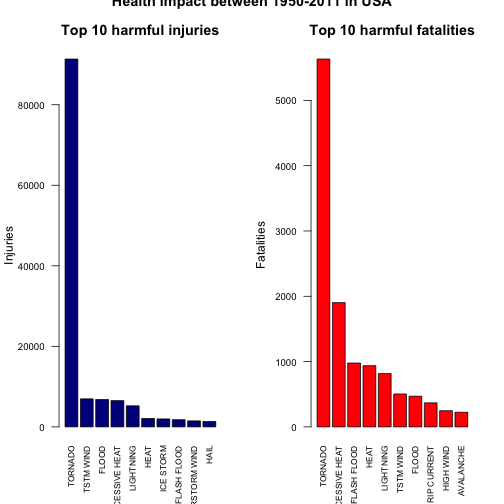
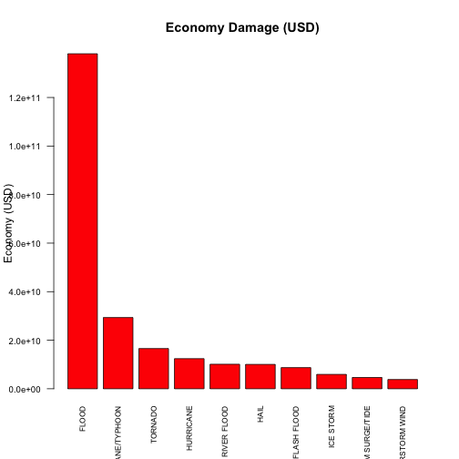
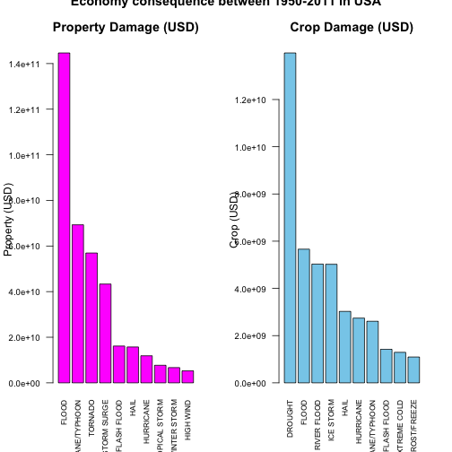

* *Author - Sanjeev Kumar Maheve*
* *Dated -  August 23, 2015*

### Synopsis
In this report we aim to explore the U.S. National Oceanic and Atmospheric Administration's (NOAA) storm database. This database tracks characteristics of major storms and weather events in the United States, including when and where they occur, as well as estimates of any fatalities, injuries, and property damage. From these data, we found that Tornado causes major harmful injuries whereas Tornado, Heat, Lightening and Flood are major fatal weather events causes death in USA.


```r
library(knitr)
# Setting the global options.
opts_chunk$set(echo = TRUE)
```

### Reading in the dataset from year 1950 till end in November 2011

```r
## Download the said file from the location given below
##
inputfile <- paste("storm_data", ".bz2", sep="")
if(!file.exists(inputfile)) {
    fileUrl <- "https://d396qusza40orc.cloudfront.net/repdata%2Fdata%2FStormData.csv.bz2"
    download.file(fileUrl, destfile = inputfile, method = "curl")
}

# Load the data as per default column type information.
df <- read.table(inputfile, 
                 header=TRUE, 
                 sep=",",
                 na.strings="",
                 strip.white = TRUE,
                 stringsAsFactors = FALSE)
str(df)
```

```
## 'data.frame':	902297 obs. of  37 variables:
##  $ STATE__   : num  1 1 1 1 1 1 1 1 1 1 ...
##  $ BGN_DATE  : chr  "4/18/1950 0:00:00" "4/18/1950 0:00:00" "2/20/1951 0:00:00" "6/8/1951 0:00:00" ...
##  $ BGN_TIME  : chr  "0130" "0145" "1600" "0900" ...
##  $ TIME_ZONE : chr  "CST" "CST" "CST" "CST" ...
##  $ COUNTY    : num  97 3 57 89 43 77 9 123 125 57 ...
##  $ COUNTYNAME: chr  "MOBILE" "BALDWIN" "FAYETTE" "MADISON" ...
##  $ STATE     : chr  "AL" "AL" "AL" "AL" ...
##  $ EVTYPE    : chr  "TORNADO" "TORNADO" "TORNADO" "TORNADO" ...
##  $ BGN_RANGE : num  0 0 0 0 0 0 0 0 0 0 ...
##  $ BGN_AZI   : chr  NA NA NA NA ...
##  $ BGN_LOCATI: chr  NA NA NA NA ...
##  $ END_DATE  : chr  NA NA NA NA ...
##  $ END_TIME  : chr  NA NA NA NA ...
##  $ COUNTY_END: num  0 0 0 0 0 0 0 0 0 0 ...
##  $ COUNTYENDN: logi  NA NA NA NA NA NA ...
##  $ END_RANGE : num  0 0 0 0 0 0 0 0 0 0 ...
##  $ END_AZI   : chr  NA NA NA NA ...
##  $ END_LOCATI: chr  NA NA NA NA ...
##  $ LENGTH    : num  14 2 0.1 0 0 1.5 1.5 0 3.3 2.3 ...
##  $ WIDTH     : num  100 150 123 100 150 177 33 33 100 100 ...
##  $ F         : int  3 2 2 2 2 2 2 1 3 3 ...
##  $ MAG       : num  0 0 0 0 0 0 0 0 0 0 ...
##  $ FATALITIES: num  0 0 0 0 0 0 0 0 1 0 ...
##  $ INJURIES  : num  15 0 2 2 2 6 1 0 14 0 ...
##  $ PROPDMG   : num  25 2.5 25 2.5 2.5 2.5 2.5 2.5 25 25 ...
##  $ PROPDMGEXP: chr  "K" "K" "K" "K" ...
##  $ CROPDMG   : num  0 0 0 0 0 0 0 0 0 0 ...
##  $ CROPDMGEXP: chr  NA NA NA NA ...
##  $ WFO       : chr  NA NA NA NA ...
##  $ STATEOFFIC: chr  NA NA NA NA ...
##  $ ZONENAMES : chr  NA NA NA NA ...
##  $ LATITUDE  : num  3040 3042 3340 3458 3412 ...
##  $ LONGITUDE : num  8812 8755 8742 8626 8642 ...
##  $ LATITUDE_E: num  3051 0 0 0 0 ...
##  $ LONGITUDE_: num  8806 0 0 0 0 ...
##  $ REMARKS   : chr  NA NA NA NA ...
##  $ REFNUM    : num  1 2 3 4 5 6 7 8 9 10 ...
```

After reading in U.S. National Oceanic and Atmospheric Administration's (NOAA) storm database between 1950 - 2011, there are ```902297``` observations in the dataset.

### Across the United States, which types of events (as indicated in the EVTYPE variable) are most harmful with respect to population health?

```r
library(dplyr)
```

```
## 
## Attaching package: 'dplyr'
## 
## The following objects are masked from 'package:stats':
## 
##     filter, lag
## 
## The following objects are masked from 'package:base':
## 
##     intersect, setdiff, setequal, union
```

```r
library(datasets)
library(ggplot2) 

# Group the data based on the event type and aggregate for 
# injuries and fatalities.
injuryStats <- aggregate (INJURIES~EVTYPE, data=df, FUN=sum, na.rm=TRUE) %>%
    filter(INJURIES > 0) %>%
    arrange(desc(INJURIES))
fatalStats <- aggregate (FATALITIES~EVTYPE, data=df, FUN=sum, na.rm=TRUE) %>%
    filter(FATALITIES > 0) %>%
    arrange(desc(FATALITIES))
```

#### Results (entire USA analysis) - showing health impacts due to weather events.

```r
# Lets show the first few observations in 2 columns plot. 
par(mfrow = c(1, 2))
par(mar=c(5.1,4.1,4.1,2.1))
barplot(injuryStats$INJURIES[1:10],
        names.arg = injuryStats$EVTYPE[1:10],
        main = "Top 10 harmful injuries",
        ylab = "Injuries",
        col="darkblue",
        cex.axis = 0.8,
        cex.names = 0.7,
        las = 2)
barplot(fatalStats$FATALITIES[1:10], 
        names.arg = fatalStats$EVTYPE[1:10],
        main = "Top 10 harmful fatalities",
        ylab = "Fatalities",
        col="red",
        cex.axis = 0.8,
        cex.names = 0.7,
        las = 2)
title("Health impact between 1950-2011 in USA", 
      outer = TRUE)
```

 

**Summary Report**
The weather event that was the most harmful to human health between 1950 - 2011 is **Tornado** followed by **TSTM Wind and Flood**. Refer the results below:


```r
head(injuryStats)
```

```
##           EVTYPE INJURIES
## 1        TORNADO    91346
## 2      TSTM WIND     6957
## 3          FLOOD     6789
## 4 EXCESSIVE HEAT     6525
## 5      LIGHTNING     5230
## 6           HEAT     2100
```

```r
head(fatalStats)
```

```
##           EVTYPE FATALITIES
## 1        TORNADO       5633
## 2 EXCESSIVE HEAT       1903
## 3    FLASH FLOOD        978
## 4           HEAT        937
## 5      LIGHTNING        816
## 6      TSTM WIND        504
```

### Across the United States, which types of events have the greatest economic consequences?
The variables PROPDMGEXP and CROPDMGEXP have the factor of multiplicity of the variables PROPDMG and CROPDMG with the values:

* H -> 100  
* K -> 1000  
* M -> 1000,000  
* B -> 1000,000,000  


```r
# Map all the unit mentioned above to common base unit.
# PROP
df$PROPDMGEXP <- gsub("NA", 1e0, df$PROPDMGEXP, ignore.case = TRUE)
df$PROPDMGEXP <- gsub("H", 1e2, df$PROPDMGEXP, ignore.case = TRUE)
df$PROPDMGEXP <- gsub("K", 1e3, df$PROPDMGEXP, ignore.case = TRUE)
df$PROPDMGEXP <- gsub("M", 1e6, df$PROPDMGEXP, ignore.case = TRUE)
df$PROPDMGEXP <- gsub("B", 1e9, df$PROPDMGEXP, ignore.case = TRUE)
df$PROPDMGEXP <- as.numeric(df$PROPDMGEXP)
```

```
## Warning: NAs introduced by coercion
```

```r
# CROP
df$CROPDMGEXP <- gsub("NA", 1e0, df$CROPDMGEXP, ignore.case = TRUE)
df$CROPDMGEXP <- gsub("H", 1e2, df$CROPDMGEXP, ignore.case = TRUE)
df$CROPDMGEXP <- gsub("K", 1e3, df$CROPDMGEXP, ignore.case = TRUE)
df$CROPDMGEXP <- gsub("M", 1e6, df$CROPDMGEXP, ignore.case = TRUE)
df$CROPDMGEXP <- gsub("B", 1e9, df$CROPDMGEXP, ignore.case = TRUE)
df$CROPDMGEXP <- as.numeric(df$CROPDMGEXP)
```

```
## Warning: NAs introduced by coercion
```

```r
# Create new column(s) using combination of existing columns for 
# PROP and CROP
df <- df %>% 
    mutate(PROPTOTALDMG = PROPDMG * PROPDMGEXP) %>%
    mutate(CROPTOTALDMG = CROPDMG * CROPDMGEXP)
df <- df %>% mutate(ECONOMYTOTALDMG = PROPTOTALDMG + CROPTOTALDMG)
str(df)
```

```
## 'data.frame':	902297 obs. of  40 variables:
##  $ STATE__        : num  1 1 1 1 1 1 1 1 1 1 ...
##  $ BGN_DATE       : chr  "4/18/1950 0:00:00" "4/18/1950 0:00:00" "2/20/1951 0:00:00" "6/8/1951 0:00:00" ...
##  $ BGN_TIME       : chr  "0130" "0145" "1600" "0900" ...
##  $ TIME_ZONE      : chr  "CST" "CST" "CST" "CST" ...
##  $ COUNTY         : num  97 3 57 89 43 77 9 123 125 57 ...
##  $ COUNTYNAME     : chr  "MOBILE" "BALDWIN" "FAYETTE" "MADISON" ...
##  $ STATE          : chr  "AL" "AL" "AL" "AL" ...
##  $ EVTYPE         : chr  "TORNADO" "TORNADO" "TORNADO" "TORNADO" ...
##  $ BGN_RANGE      : num  0 0 0 0 0 0 0 0 0 0 ...
##  $ BGN_AZI        : chr  NA NA NA NA ...
##  $ BGN_LOCATI     : chr  NA NA NA NA ...
##  $ END_DATE       : chr  NA NA NA NA ...
##  $ END_TIME       : chr  NA NA NA NA ...
##  $ COUNTY_END     : num  0 0 0 0 0 0 0 0 0 0 ...
##  $ COUNTYENDN     : logi  NA NA NA NA NA NA ...
##  $ END_RANGE      : num  0 0 0 0 0 0 0 0 0 0 ...
##  $ END_AZI        : chr  NA NA NA NA ...
##  $ END_LOCATI     : chr  NA NA NA NA ...
##  $ LENGTH         : num  14 2 0.1 0 0 1.5 1.5 0 3.3 2.3 ...
##  $ WIDTH          : num  100 150 123 100 150 177 33 33 100 100 ...
##  $ F              : int  3 2 2 2 2 2 2 1 3 3 ...
##  $ MAG            : num  0 0 0 0 0 0 0 0 0 0 ...
##  $ FATALITIES     : num  0 0 0 0 0 0 0 0 1 0 ...
##  $ INJURIES       : num  15 0 2 2 2 6 1 0 14 0 ...
##  $ PROPDMG        : num  25 2.5 25 2.5 2.5 2.5 2.5 2.5 25 25 ...
##  $ PROPDMGEXP     : num  1000 1000 1000 1000 1000 1000 1000 1000 1000 1000 ...
##  $ CROPDMG        : num  0 0 0 0 0 0 0 0 0 0 ...
##  $ CROPDMGEXP     : num  NA NA NA NA NA NA NA NA NA NA ...
##  $ WFO            : chr  NA NA NA NA ...
##  $ STATEOFFIC     : chr  NA NA NA NA ...
##  $ ZONENAMES      : chr  NA NA NA NA ...
##  $ LATITUDE       : num  3040 3042 3340 3458 3412 ...
##  $ LONGITUDE      : num  8812 8755 8742 8626 8642 ...
##  $ LATITUDE_E     : num  3051 0 0 0 0 ...
##  $ LONGITUDE_     : num  8806 0 0 0 0 ...
##  $ REMARKS        : chr  NA NA NA NA ...
##  $ REFNUM         : num  1 2 3 4 5 6 7 8 9 10 ...
##  $ PROPTOTALDMG   : num  25000 2500 25000 2500 2500 2500 2500 2500 25000 25000 ...
##  $ CROPTOTALDMG   : num  NA NA NA NA NA NA NA NA NA NA ...
##  $ ECONOMYTOTALDMG: num  NA NA NA NA NA NA NA NA NA NA ...
```

```r
# Group the data based on the event type and aggregate for 
# property, crop and combined for economy.
propStats <- aggregate (PROPTOTALDMG~EVTYPE, data=df, FUN=sum, na.rm=TRUE) %>%
    filter(PROPTOTALDMG > 0) %>%
    arrange(desc(PROPTOTALDMG))
cropStats <- aggregate (CROPTOTALDMG~EVTYPE, data=df, FUN=sum, na.rm=TRUE) %>%
    filter(CROPTOTALDMG > 0) %>%
    arrange(desc(CROPTOTALDMG))
economyStats <- aggregate (ECONOMYTOTALDMG~EVTYPE, data=df, FUN=sum, na.rm=TRUE) %>%
    filter(ECONOMYTOTALDMG > 0) %>%
    arrange(desc(ECONOMYTOTALDMG))
```

#### Results (entire USA analysis) - showing economy consequencies due to weather events.

```r
# Lets show the first few observations in 2 columns plot.
barplot(economyStats$ECONOMYTOTALDMG[1:10],
        names.arg = economyStats$EVTYPE[1:10],
        main = "Economy Damage (USD)",
        ylab = "Economy (USD)",
        col="red",
        cex.axis = 0.8,
        cex.names = 0.7,
        las = 2)
```

 

```r
par(mfrow = c(1, 2))
par(mar=c(5.1,4.1,4.1,2.1))
barplot(propStats$PROPTOTALDMG[1:10],
        names.arg = propStats$EVTYPE[1:10],
        main = "Property Damage (USD)",
        ylab = "Property (USD)",
        col="magenta",
        cex.axis = 0.8,
        cex.names = 0.7,
        las = 2)
barplot(cropStats$CROPTOTALDMG[1:10], 
        names.arg = cropStats$EVTYPE[1:10],
        main = "Crop Damage (USD)",
        ylab = "Crop (USD)",
        col="skyblue",
        cex.axis = 0.8,
        cex.names = 0.7,
        las = 2)
title("Economy consequence between 1950-2011 in USA", 
      outer = TRUE)
```

 

**Summary Report**  
The weather event that resulted in bad economy consequences between 1950 - 2011 is **Flood** followed by **Hurricane/Typhoon and Tornado** for property and **Drought** followed by **Flood** for Crops.  

```r
head(economyStats)
```

```
##              EVTYPE ECONOMYTOTALDMG
## 1             FLOOD    138007444500
## 2 HURRICANE/TYPHOON     29348167800
## 3           TORNADO     16570326150
## 4         HURRICANE     12405268000
## 5       RIVER FLOOD     10108369000
## 6              HAIL     10045596740
```

```r
head(propStats)
```

```
##              EVTYPE PROPTOTALDMG
## 1             FLOOD 144657709800
## 2 HURRICANE/TYPHOON  69305840000
## 3           TORNADO  56937160991
## 4       STORM SURGE  43323536000
## 5       FLASH FLOOD  16140812087
## 6              HAIL  15732267370
```

```r
head(cropStats)
```

```
##        EVTYPE CROPTOTALDMG
## 1     DROUGHT  13972566000
## 2       FLOOD   5661968450
## 3 RIVER FLOOD   5029459000
## 4   ICE STORM   5022113500
## 5        HAIL   3025954450
## 6   HURRICANE   2741910000
```
